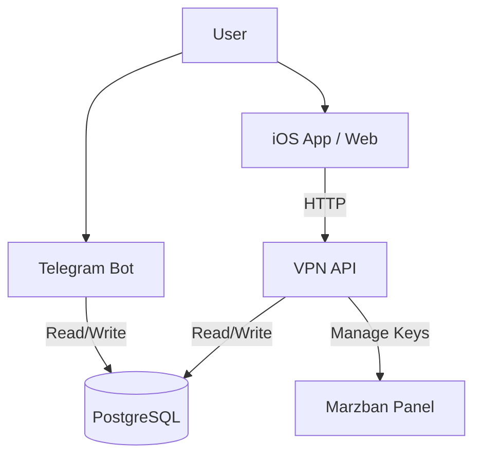

# 🗄️ План миграции на единую базу данных (PostgreSQL)

**Цель:** Устранить "Split Brain" (рассинхронизацию данных) между Telegram ботом и API, объединив две SQLite базы в одну надежную PostgreSQL.
**Инструменты:** Docker, PostgreSQL, Prisma ORM (для типизации и миграций).

---

## 1. Новая архитектура

Вместо двух файлов `database.sqlite` и `db.sqlite` мы будем использовать один PostgreSQL сервер.



---

## 2. Схема данных (Prisma Schema)

Предлагаемая объединенная схема, покрывающая нужды обоих сервисов.

```prisma
// schema.prisma

datasource db {
  provider = "postgresql"
  url      = env("DATABASE_URL")
}

generator client {
  provider = "prisma-client-js"
}

model User {
  id          BigInt   @id // Telegram ID
  username    String?
  firstName   String?  @map("first_name")
  language    String   @default("ru")
  
  // Поля из бота
  discountPercent Int       @default(0) @map("discount_percent")
  marketingOptOut Boolean   @default(false) @map("marketing_opt_out")
  
  // Связи
  subscription  Subscription?
  orders        Order[]
  referrals     Referral[]     @relation("Referrer")
  referredBy    Referral?      @relation("ReferredUser")
  vpnKeys       VpnKey[]

  createdAt     DateTime @default(now()) @map("created_at")
  updatedAt     DateTime @updatedAt @map("updated_at")

  @@map("users")
}

model Subscription {
  userId    BigInt   @id @map("user_id")
  user      User     @relation(fields: [userId], references: [id], onDelete: Cascade)
  
  isActive  Boolean  @default(false) @map("is_active")
  expiresAt DateTime? @map("expires_at")
  
  // Кэш ключа (основной ключ)
  vlessKey  String?  @map("vless_key")

  updatedAt DateTime @updatedAt @map("updated_at")

  @@map("subscriptions")
}

model Order {
  id        String   @id @default(uuid()) // UUID заказа
  userId    BigInt   @map("user_id")
  user      User     @relation(fields: [userId], references: [id])
  
  planId    String   @map("plan_id")
  amount    Decimal  @db.Decimal(10, 2)
  currency  String   @default("RUB")
  
  status    OrderStatus @default(PENDING)
  
  // Платежные данные
  provider          PaymentProvider // YOOKASSA, TELEGRAM_STARS, etc.
  externalPaymentId String?         @map("external_payment_id") // yookassa_payment_id
  
  createdAt DateTime @default(now()) @map("created_at")
  updatedAt DateTime @updatedAt @map("updated_at")

  @@index([userId])
  @@index([externalPaymentId])
  @@map("orders")
}

model VpnKey {
  id        Int      @id @default(autoincrement())
  userId    BigInt   @map("user_id")
  user      User     @relation(fields: [userId], references: [id])
  
  key       String
  type      String   @default("vless")
  isActive  Boolean  @default(true) @map("is_active")
  
  createdAt DateTime @default(now()) @map("created_at")

  @@map("vpn_keys")
}

enum OrderStatus {
  PENDING
  PAID
  CANCELED
  FAILED
}

enum PaymentProvider {
  YOOKASSA
  TELEGRAM_STARS
  CRYPTO
  MANUAL
}

model Referral {
  userId       BigInt @id @map("user_id") // Тот, КТО пригласил (владелец кода)
  user         User   @relation("Referrer", fields: [userId], references: [id])
  
  referralCode String @unique @map("referral_code")
  
  referredById BigInt? @map("referred_by") // Тот, КТО его пригласил
  referredBy   User?   @relation("ReferredUser", fields: [referredById], references: [id])

  @@map("referrals")
}
```

---

## 3. Этапы миграции

### Этап 1: Подготовка (Локально)
1.  Создать папку `packages/database` (или в `vpn_api`).
2.  Инициализировать Prisma: `npx prisma init`.
3.  Создать `docker-compose.yml` с Postgres.
4.  Применить схему: `npx prisma db push`.

### Этап 2: Скрипт миграции данных
Написать TS-скрипт, который:
1.  Читает `vpn_bot/data/database.sqlite`.
2.  Читает `vpn_api/data/db.sqlite`.
3.  **Users:** Переносит пользователей из бота в Postgres (конфликтов быть не должно, `id` = telegram_id).
4.  **Orders:**
    *   Переносит заказы из бота.
    *   Переносит заказы из API.
    *   *Важно:* Проверить дубликаты (если один и тот же заказ есть в обоих базах). В API `order_id` - UUID, в боте - может отличаться.
5.  **Subscriptions:** Берет данные из бота (там они точнее, так как бот управляет продлением).

### Этап 3: Обновление кода (Refactoring)
1.  **VPN API:**
    *   Заменить `better-sqlite3` на `PrismaClient`.
    *   Удалить код с `ATTACH DATABASE`.
    *   Переписать репозитории (`ordersRepo.ts`, `keysRepo.ts`).
2.  **VPN Bot:**
    *   Заменить `better-sqlite3` на `PrismaClient`.
    *   Переписать сервисы (`userService.ts`, `orderService.ts`).

### Этап 4: Деплой
1.  Остановить сервисы.
2.  Сделать бэкап SQLite файлов.
3.  Запустить Postgres.
4.  Запустить скрипт миграции.
5.  Запустить обновленные сервисы.

---

## 4. Пример скрипта миграции (Концепт)

```typescript
import Database from 'better-sqlite3';
import { PrismaClient } from '@prisma/client';

const prisma = new PrismaClient();
const botDb = new Database('./vpn_bot/data/database.sqlite');
const apiDb = new Database('./vpn_api/data/db.sqlite');

async function migrate() {
  console.log('Starting migration...');

  // 1. Users
  const botUsers = botDb.prepare('SELECT * FROM users').all();
  for (const u of botUsers) {
    await prisma.user.create({
      data: {
        id: BigInt(u.id), // Telegram ID
        username: u.username,
        firstName: u.first_name,
        // ... остальные поля
      }
    });
  }
  
  // 2. Orders from API (они важнее для платежей)
  const apiOrders = apiDb.prepare('SELECT * FROM orders').all();
  for (const o of apiOrders) {
    // Парсим user_ref (tg_12345 -> 12345)
    const userId = BigInt(o.user_ref.replace('tg_', ''));
    
    await prisma.order.create({
      data: {
        id: o.order_id,
        userId: userId,
        status: mapStatus(o.status),
        amount: o.amount_value,
        provider: 'YOOKASSA',
        externalPaymentId: o.yookassa_payment_id
      }
    });
  }

  console.log('Migration completed!');
}
```
